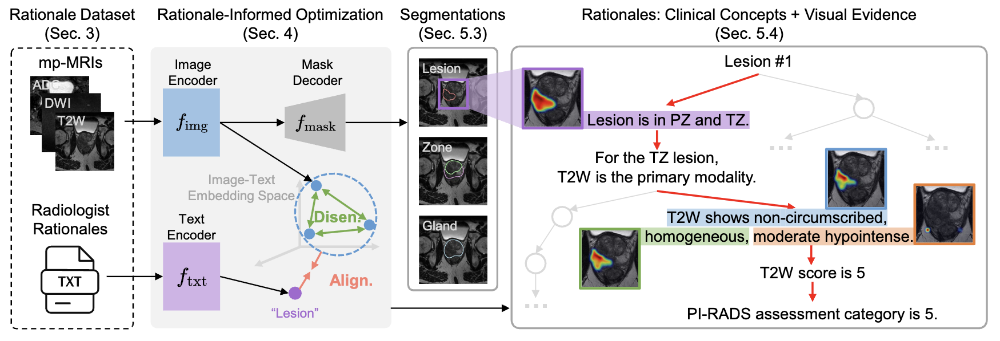
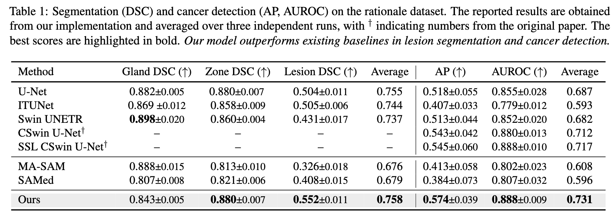
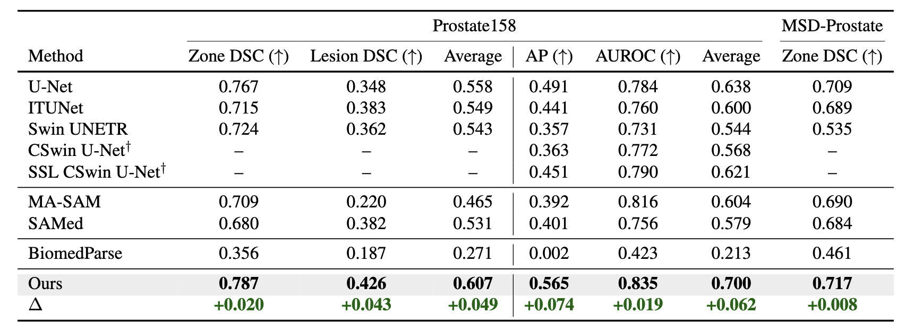
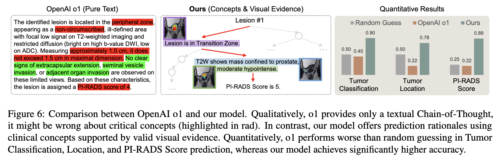

# “Why Is There a Tumor?”: Tell Me the Reason, Show Me the Evidence (ICML 2025)

[[Paper](https://openreview.net/pdf?id=r3ZLefVUMO)] [[Code](https://github.com/deep-real/MedRationale)] [[DeepREAL Lab](https://deep-real.github.io/)]

Code coming soon!

This repository holds the Pytorch implementation of  [https://github.com/deep-real/MedRationale](https://openreview.net/pdf?id=r3ZLefVUMO) by Mengmeng Ma, Tang Li, Yunxiang Peng, Lu Lin, Volkan Beylergil, Binsheng Zhao, Oguz Akin and Xi Peng.
If you find our code useful in your research, please consider citing:

```
@inproceedings{li2023dre,
 title={“Why Is There a Tumor?”: Tell Me the Reason, Show Me the Evidence},
 author={Ma, Mengmeng and Li, Tang and Peng, Yunxiang and Lin, Lu and Beylergil, Volkan and Zhao, Binsheng and Akin, Oguz and Peng, Xi},
 booktitle={Proceedings of the International Conference on Machine Learning (ICML)},
 year={2025}
}
```

## Introduction
We developed a model for MRI Image Analysis that can justify the segmentation or detection using clinically relevant terms and point to visual evidence. Evaluation was done on medical benchmarks which demostrates our model's superior performance in segmentation, detection, and beyond.

We study the out-of-distribution (OOD) robustness of data-driven explanations.
Our evaluations prove that data-driven explanations are susceptible to distributional shifts.
However, acquiring the ground truth explanations for all samples or obtaining the one-to-one mapping between samples from different distributions are prohibitively expensive or even impossible in practice.
To this end, we propose Distributionally Robust Explanation (DRE) that, inspired by self-supervised learning, leveraging the mixed explanation to provide supervisory signals for the learning of explanations.




## Evaluations
Quantitative results on the evaluation set and zero-shot evaluation on other datasets collected from various unseen locations



Comparison between OpenAI o1 and our model. Qualitatively, o1 provides only a textual Chain-of-Thought,
it might be wrong about critical concepts (highlighted in rad). In contrast, our model offers prediction rationales using
clinical concepts supported by valid visual evidence. Quantitatively, o1 performs worse than random guessing in Tumor
Classification, Location, and PI-RADS Score prediction, whereas our model achieves significantly higher accuracy.

