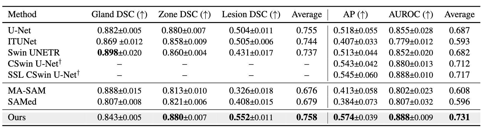
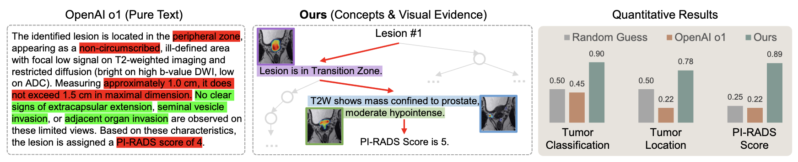

# “Why Is There a Tumor?”: Tell Me the Reason, Show Me the Evidence (ICML 2025)

[[Paper](https://openreview.net/pdf?id=r3ZLefVUMO)] [[Code](https://github.com/deep-real/MedRationale)] [[DeepREAL Lab](https://deep-real.github.io/)]

Code coming soon!

This repository holds the Pytorch implementation of  [https://github.com/deep-real/MedRationale](https://openreview.net/pdf?id=r3ZLefVUMO) by Mengmeng Ma, Tang Li, Yunxiang Peng, Lu Lin, Volkan Beylergil, Binsheng Zhao, Oguz Akin and Xi Peng.
If you find our code useful in your research, please consider citing:

```
@inproceedings{
ma2025why,
title={''Why Is There a Tumor?'': Tell Me the Reason, Show Me the Evidence},
author={Mengmeng Ma and Tang Li and Yunxiang Peng and Lu Lin and Volkan Beylergil and Binsheng Zhao and Oguz Akin and Xi Peng},
booktitle={Forty-second International Conference on Machine Learning},
year={2025},
url={https://openreview.net/forum?id=r3ZLefVUMO}
}
```

## Introduction
We developed a model for MRI Image Analysis that can justify the segmentation or detection using clinically relevant terms and point to visual evidence. Evaluation was done on medical benchmarks which demostrates our model's superior performance in segmentation, detection, and beyond.


## Evaluations
### Quantitative results on the evaluation set


### Zero-shot evaluation
Zero-shot evaluation on datasets collected from various unseen locations


### Comparison between OpenAI o1 and our mode


